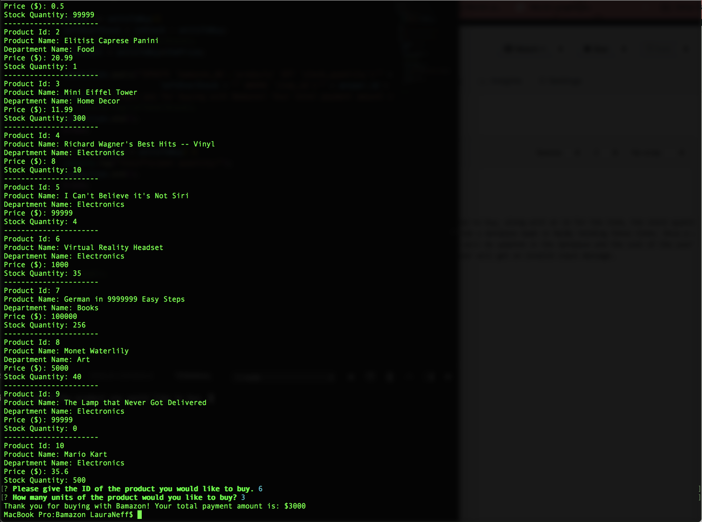
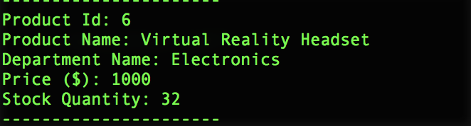
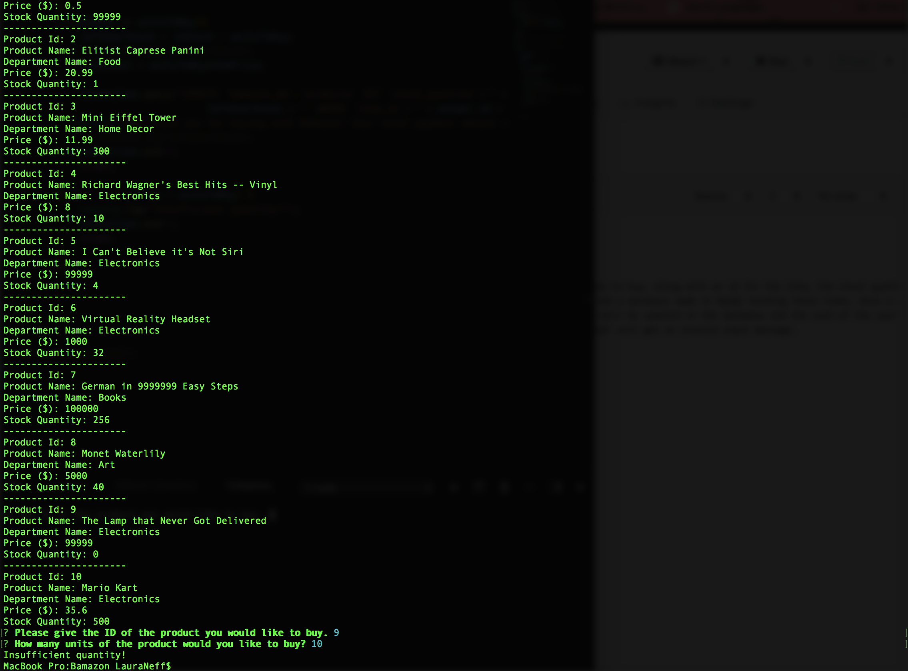
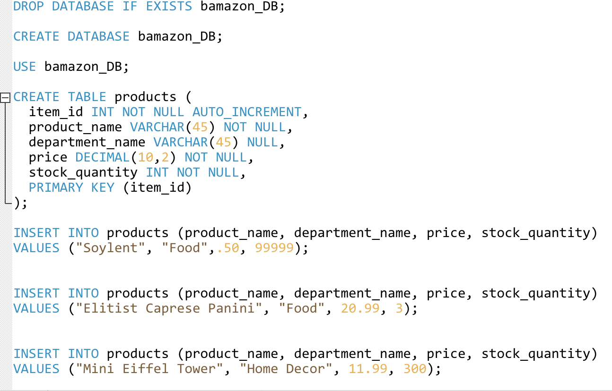

# Bamazon

DEVELOPER: LAURA NEFF

A Node application that models Amazon. User is given a list of items they can choose to buy, along with an id for the item, the stock quantity, its
price, and the department it belongs to. These items are printed to the terminal from a database made in MySQL holding these items. Once a user
decides on an item to buy, if the item is in stock, the stock quantity of the item will be updated in the database and the cost of the user's purchase
will be calculated and printed to the terminal. If the item is not in stock, the user will get an invalid input message.  

